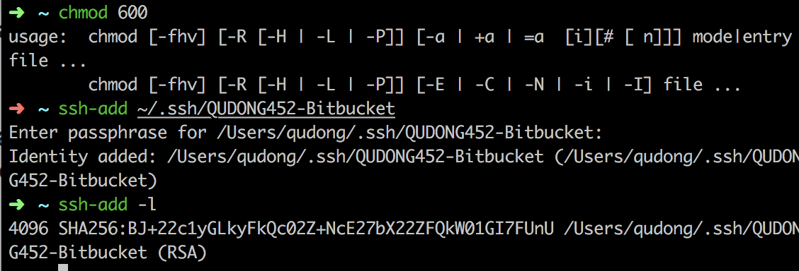

## I. Basic Setup

### Badassify your ternimal and shell [todo] -> [done]

> <http://jilles.me/badassify-your-terminal-and-shell>

just follow **all** of the instructions, which is indeed quite useful and powerful


## II. Setting up Github Page

### Installing and Get Started with Jekyll

> https://jekyllrb.com/docs/quickstart/
> for my infor about **kramdown**: https://github.com/blog/2100-github-pages-now-faster-and-simpler-with-jekyll-3-0

#### Requirement for Jekyll

> https://stackoverflow.com/questions/38194032/how-to-update-ruby-version-2-0-0-to-the-latest-version-in-mac-osx-yosemite
> https://rubygems.org/pages/download
> https://jekyllrb.com/docs/installation/#requirements

##### 1. Update Ruby

1. `rvm list known`
2. `rvm install ruby-2.5.0`
3. `ruby -v` will give you `ruby 2.5.0p0 (2017-12-25 revision 61468) [x86_64-darwin16]`

##### 2. Update RubyGems

1. `gem update --system`
2. `gem -v` will give you `2.7.5`


#### Install Jekyll

> <https://jekyllrb.com/docs/quickstart/>
> https://jekyllrb.com/docs/installation/#requirements

**`gem install jekyll bundle`**

#### Markdown Renderer [todo]

Defualt: `markdown:    kramdown`

https://kramdown.gettalong.org/converter/html.html

##### Auto link in `kramdown`

<https://kramdown.gettalong.org/syntax.html#automatic-links>

##### Red Carpet

> https://jekyllrb.com/docs/configuration/#markdown-options

### Using Template

[todo-qd]: <https://help.github.com/articles/adding-a-jekyll-theme-to-your-github-pages-site/>

1. ncluded gem jekyll-theme-cayman in my Gemfile, and comment `gem "minima", "~> 2.0"`
    ```ruby
    gem "jekyll-theme-cayman", group: :jekyll_plugins
    ```
1. In Gemfile, just added the line `source 'https//rubygems.org`
2. ran `bundle install`
3. To upgrade, run `bundle update github-pages`
3. included theme: jekyll-theme-cayman in _config.yml
    ```
    theme: jekyll-theme-cayman
    ```
4. ran `bundle exec jekyll serve` which start the static web in `http://127.0.0.1:4000/`

### Continue with Jekyll

**[todo-qd] read through the Jekyll official site to understand the whole concept and philosiphy, and review my airbab page in github repo udacity**


## III. Shell Text Editor [todo]

**nano, Emacs & Vim**

**I use nano for the moment..**

> https://wiki.gentoo.org/wiki/Nano

It seems that using nano paste in Mac is not straightforward enough
https://apple.stackexchange.com/questions/110793/how-to-copy-and-paste-lines-in-nano-on-osx

To move the cursor to the line-start and line-end: use `control+a` and `control+e`

* line start: `^+a`
* line end: `^+e`


## IV. Make IPython console Available in Pycharm *[todo]->[done]*

> https://www.jetbrains.com/help/pycharm/scientific-tools.html
> http://jupyter.org/

Based on my brief jupyter, it is quite a powerful collections of tools for write notebook, and also kick start the IPython console. Currently, i only use it to initiate the IPython console, but later will also explore more about it's power.

1. Install the jupyter by using `pip3 install jupyter`
2. (optionally) Install `PyQt5`, as it looks like that basically it's the only version being supported in Python3.6. Yes, i'm now using Python3.6 in Mac
3. Open the IPython console by running `jupyter qtconsole`!

That is all! And th `qtconsole` is so strong in Unix-like env, as it also supports the linux command (`ls` etc!)

## V. Building my Old Django Blog in the server

**Important: the server I use to deploy is `HeroKu`**

**The Email I use to register is u0905217@gmail.com**

**I used the qudong452@gmail.com, but I forgot the pwd and now cannot log-in**


## VI. Setting Up the Virtual Environment for Python (virtualenv)

> http://django-tinymce.readthedocs.io/en/latest/installation.html#prerequisites

1. navigate to Documents/
2. in bash: type `mkdir tinymce_test`
3. `ls tinymce_test`
4. after we are in the project dir 
5. build the virtualenv in this project
6. by typing `virtualenv --no-site-packages env`
    * it will show: `Using base prefix '/usr/local/Cellar/python3/3.6.4_2/Frameworks/Python.framework/Versions/3.6'
New python executable in /Users/qudong/env/bin/python3.6
Also creating executable in /Users/qudong/env/bin/python
Installing setuptools, pip, wheel...done.`
7. 


## VII. Using the Virtualenv to Build a Django APP with tinymce

[TODO]

## VIII. Sublime Text 3 Setup

In General the Packages Need to be installed and the settings and keymaps are in my *Dropbpx->sublime->User*

### 1. key bindings (keymap)

Move the cursor in 4 different directions

```json
[
 { "keys": ["super+k"], "command": "move", "args": {"by": "characters", "forward": false} },
    { "keys": ["super+;"], "command": "move", "args": {"by": "characters", "forward": true} },
    { "keys": ["super+o"], "command": "move", "args": {"by": "lines", "forward": false} },
    { "keys": ["super+l"], "command": "move", "args": {"by": "lines", "forward": true} },   
]
```

### 2. Sublime Preferences -> General settings

```json
{
    "added_words":
    [
        "iterable",
        "lifecycle"
    ],
    "color_scheme": "Packages/Color Scheme - Default/Monokai.tmTheme",
    "font_face": "Consolas",
    "font_size": 16,
    "highlight_modified_tabs": true,
    "ignored_packages":
    [
        "Sublime Linter",
        "Vintage"
    ],
    "open_files_in_new_window": false,
    "spell_check": true,
    "tab_size": 4,
    "translate_tabs_to_spaces": true,
    "word_separators": "./\\()\"'-:,.;<>~!@#%^&*|+=[]{}`~?"
}
```

**Note: By default, the "Markdown" is in the "ignored_packages", I need to overwrite it, otherwise I will have the problem of `MarkdownEditing` is not working

### 3. Creating the TOC using the MarkdownTOC plug in for Sublime 3

<https://github.com/naokazuterada/MarkdownTOC>

Please watch the GIF in the above links, to auto generate the autolink for the TOC, I not only need to change the user settings for MarkdownTOC, but also change the parameters in each .md files, with the param of `autolink="true"`:

```
<!-- MarkdownTOC autolink="true" -->

- [Heading 1](#heading-1)
  - [Heading 2](#heading-2)
  - [Heading 3](#heading-3)

<!-- /MarkdownTOC -->
```

## IX. Connecting to BitBucket

<https://stackoverflow.com/questions/21255438/permission-denied-publickey-fatal-could-not-read-from-remote-repository-whil>


[back](../)