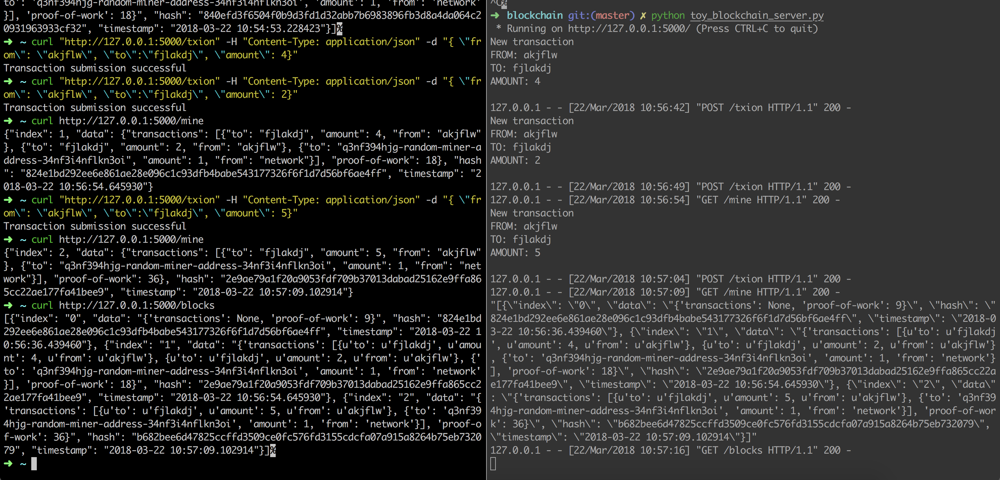
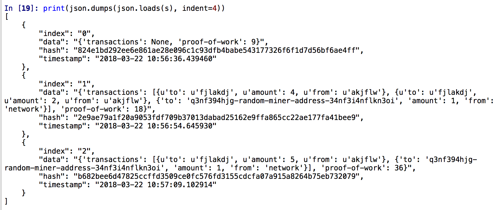

## Table of Contents

{:.no_toc}

* Will be replaced with the ToC, excluding the "Contents" header
{:toc}

## Get Started Reference

<https://medium.com/crypto-currently/lets-build-the-tiniest-blockchain-e70965a248b>
<https://mp.weixin.qq.com/s/GrpY52N5VDWB7UOqmIadUg>

- an immutable chain
- are not issued or managed by central authority (去中心化)
- distributed computing


## Definiation of BlockChain

> a **digital ledger** in which transactions made in bitcoin or another cryptocurrency are recorded chronologically and publicly.

## Running the BlockChain Flask Server with the Sample Code

<https://github.com/qd452/QuoinexMathMaX/blob/master/blockchain/toy_blockchain_server.py>

Basically, the process is

1. Create Transactions (lists of transactions in one block)
2. Miners will come and start to mine this transactions, Proof of Work (POW) will be used to limit the speed and prevent the inflation
3. After the mining process is done, this block will be appended into the block chain, during which, the miners will also be awarded with certain amount of coins in the case of Bitcoin
4. repeat the above procedures





---

## SHA-256

Reference: <https://www.movable-type.co.uk/scripts/sha256.html>

1. A **cryptographic** hash (sometimes called ‘digest’) is a kind of ‘signature’ for a text or a data file. SHA-256 generates an almost-unique 256-bit (32-byte) signature for a text.
2. A hash is not ‘encryption’ – it cannot be decrypted back to the original text (it is a ‘one-way’ cryptographic function, and is a fixed size for any size of source text).
3. Note that hash functions are not appropriate for storing encrypted passwords, as they are designed to be fast to compute, and hence would be candidates for brute-force attacks.


### Usage of SHA-256 in Bitcoin

1. Mining uses SHA-256 as the [Proof of work](<https://en.bitcoin.it/wiki/Proof_of_work>) algorithm.
2. SHA-256 is used in the [creation of bitcoin addresses](<https://en.bitcoin.it/wiki/Technical_background_of_version_1_Bitcoin_addresses#How_to_create_Bitcoin_Address>) to improve security and privacy.

#### SHA-256 pure-python Implementation

- <https://stackoverflow.com/questions/7321694/sha-256-implementation-in-python>
- <https://bitbucket.org/pypy/pypy/src/tip/lib_pypy/_sha256.py?fileviewer=file-view-default>

#### Interesting side-track

**proof of work**
**Birthday attack**
<https://en.wikipedia.org/wiki/Birthday_problem>
**Birthday problem** very simple explanation: <https://betterexplained.com/articles/understanding-the-birthday-paradox/> -> Explanation: Counting Pairs

### [Side-track] Copy in Python - Shallow and Deep copy

The difference between shallow and deep copying is only relevant for compound objects, which are objects containing other objects, like lists or class instances.

- <https://docs.python.org/2/library/copy.html>
- Very Good example: <https://stackoverflow.com/questions/2612802/how-to-clone-or-copy-a-list>
- <https://www.python-course.eu/deep_copy.php>

### [Side-track] UTF-8 an Encoding in Python 2 and Python 3

```python
import sys
import hashlib

SHA_DIGESTSIZE = 64
SHA_BLOCKSIZE = 32

is_py2 = sys.version[0] == '2'  # added py2&3 compatibility

sha = hashlib.sha256()
org_str = "hahaha"
if not is_py2:
    org_str = org_str.encode(encoding='utf8')
sha.update(org_str)
assert sha.digest_size == 32
# In Python3, cannot have 64L
# In Python3, int and long in Py2 has been mapped to int in Python
assert sha.block_size == 64  # https://stackoverflow.com/questions/23741762/why-does-python-add-an-l-on-the-end-of-the-result-of-large-exponents
rslt = sha.digest()
hexrslt = sha.hexdigest()
if is_py2:
    assert rslt == '\xbe\x17\x8c\x05C\xeb\x17\xf5\xf3\x040!\xc9\xe5\xfc\xf3\x02\x85\xe5W\xa4\xfc0\x9c\xce\x97\xff\x9c\xa6\x18)\x12'    
else:
    rslt_str = ''.join(r'\x%.2x' % x for x in rslt)
    rslt_lst = [x for x in rslt]
    assert rslt_lst[0] == 190
    # convert the list back to bytes array
    assert bytes(rslt_lst) == rslt
    
    # Note: in utf-8, code point of rslt_lst[0] is 190
    tmp = b'\xbe'
    assert type(tmp) == bytes
    assert len(tmp) == 1
    assert tmp[0] == 190
    assert tmp != '¾'  # note here is NOT equal
    assert tmp != 190  # bytes are not equivalent to its code point
    assert chr(tmp[0]) == '¾'
assert len(rslt) == sha.digest_size
assert hexrslt == 'be178c0543eb17f5f3043021c9e5fcf30285e557a4fc309cce97ff9ca6182912'

if is_py2:
    # NOTE: https://docs.python.org/2/library/functions.html#ord
    _hexrslt = ''.join(['%.2x' % ord(i) for i in rslt])
else:
    _hexrslt = ''.join('%.2x' % i for i in rslt)
    # or
    _hexrslt = ''.join('{:02x}'.format(i) for i in rslt)
assert hexrslt == _hexrslt
```


[back](../)